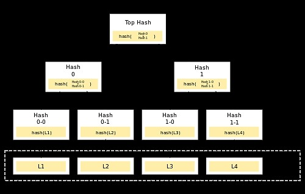

# Merkle Tree

## Introduction to Merkle Tree / Hash Tree

Merkle tree or Hash tree is a tree where each node which is not a leaf node is a hash of its connected child nodes. It uses hash functions to create unique mappings from inputs to outputs to map nodes. In such a manner, huge amounts of data are stored and mapped into the tree, hence offering a form of security due to the unique hash functions.
Hash functions are mathematical algorithms that generate unique outputs for different inputs of data. The Merkle tree being a data structure determined by hash functions makes it easy to detect the slightest alterations made to the data.
Y(I) = O   where, Y: Hash Function        I: Input     O: Output 
Y(I') = O'  is called the avalanche effect which proves that even a small change in the input yields a different output.

## Architecture of Merkle Tree

Repeated calculation of hash functions for nodes in pairs until it reaches the point where only one hash is left. This hash that is left is known as the Merkle Root or Root Hash. The tree is then traversed in bottom-up approach.
Hash of the data gives leaf nodes while hashing these hashes gives the hash for the next non-leaf node. Merkel trees are commonly in binary forms, so if there exists odd number of moves or transactions, the last hash is duplicated to create an even number of leaf nodes.

## Algorithm

;

a, b, c, and d are some data elements (files, JSON, etc) and H is a hash function. A hash function acts as a “digital fingerprint” of some piece of data by mapping it to a simple string with a low probability that any other piece of data will map to the same string. Each node is created by hashing the concatenation of its “parents” in the tree.

## Illustrate the Steps of Algorithm 

The algorithm goes as follows for an example of application of Merkle Tree: 
*Eg: Bitcoin Merkle Tree*
-	The data in the block is split into pairs.
-	Swap the bytes of the ids 
-	Join the ids of pairs by concatenation
-	To these concatenated pairs, apply double hashing 

;

## Create and Verify the Merkle Tree (Implementation using Java)

### MerkleTrees.java

    import java.security.MessageDigest;
    import java.util.ArrayList;
    import java.util.List;
    public class MerkleTrees {
	List<String> txList;
	String root;
	public MerkleTrees(List<String> txList) 
    {
		this.txList = txList;
		root = "";
	}

	public void merkle_tree() 
    {
		List<String> tempTxList = new ArrayList<String>();

		for (int i = 0; i < this.txList.size(); i++) {
			tempTxList.add(this.txList.get(i));
		}
		List<String> newTxList = getNewTxList(tempTxList);
		while (newTxList.size() != 1) {
			newTxList = getNewTxList(newTxList);
		}
		this.root = newTxList.get(0);
	}

	private List<String> getNewTxList(List<String> tempTxList) {
		List<String> newTxList = new ArrayList<String>();
		int index = 0;
		while (index < tempTxList.size()) {
			String left = tempTxList.get(index);
			index++;
			String right = "";
			if (index != tempTxList.size()) {
				right = tempTxList.get(index);
			}
			String sha2HexValue = getSHA2HexValue(left + right);
			newTxList.add(sha2HexValue);
			index++;

		}
		return newTxList;
	}

	public String getSHA2HexValue(String str) {
		byte[] cipher_byte;
		try {
			MessageDigest md = MessageDigest.getInstance("SHA-256");
			md.update(str.getBytes());
			cipher_byte = md.digest();
			StringBuilder sb = new StringBuilder(2 * cipher_byte.length);
			for (byte b : cipher_byte) {
				sb.append(String.format("%02x", b & 0xff));
			}
			return sb.toString();
		} catch (Exception e) {
			e.printStackTrace();
		}
		return "";
	}
    
	public String getRoot() 
    {
		return this.root;
	}
    }

### MerkleTest.java

    import java.util.ArrayList;
    import java.util.List;
    public class MerkleTest {
    public static void main(String[] args) {
		List<String> tempTxList = new ArrayList<String>();
		tempTxList.add("My");
		tempTxList.add("Name");
		tempTxList.add("is");
		tempTxList.add("Heera");
		tempTxList.add("Menon");

		MerkleTrees merkleTrees = new MerkleTrees(tempTxList);
		merkleTrees.merkle_tree();
		System.out.println("root : " + merkleTrees.getRoot());
	}
    }

### OUTPUT

;

## References
-	https://www.geeksforgeeks.org/introduction-to-merkle-tree/
-	https://www.pranaybathini.com/2021/05/merkle-tree.html
-	https://www.javatpoint.com/blockchain-merkle-tree
-	https://www.linkedin.com/pulse/merkle-tree-its-implementation-java-nikhil-goyal

